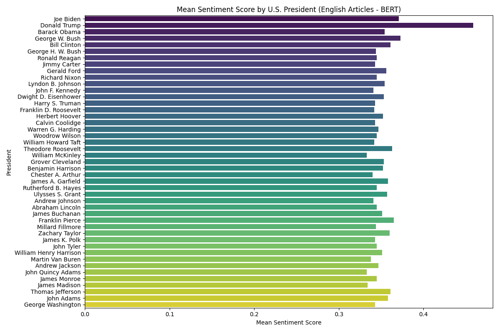
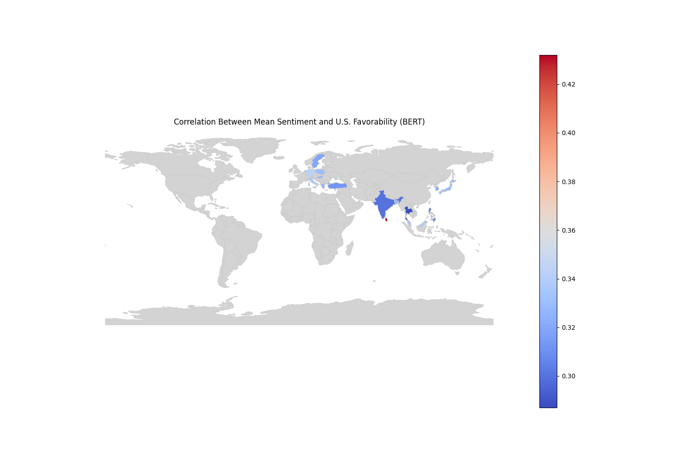
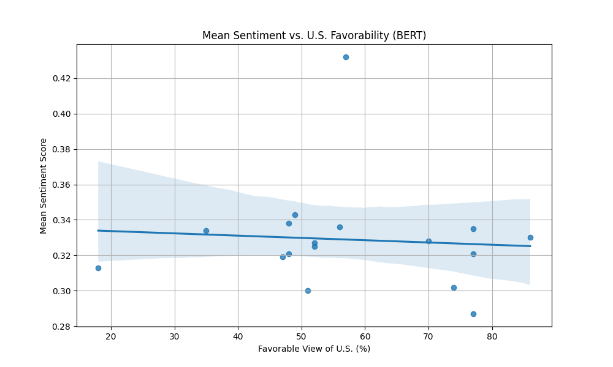

# National Favorability and Sentiment Bias: A Quantitative Analysis of Wikipedia Articles

## Project Overview

This project performs a quantitative analysis of sentiment across Wikipedia articles about U.S. presidents in multiple languages. It aims to uncover potential correlations between the sentiment expressed in these articles and the perceived favorability of the U.S. in different countries, as measured by public opinion polls.

The analysis leverages Natural Language Processing (NLP) models to gauge sentiment and employs statistical methods to investigate the relationship between language-specific sentiment and national favorability metrics.

## Key Quantitative Skills Demonstrated

This project showcases a range of in-demand quantitative and data science skills:

*   **Natural Language Processing (NLP):** Application of advanced NLP models (BERT, XLM-RoBERTa, LaBSE) for sentiment analysis and text embedding.
*   **Statistical Analysis:** Use of descriptive statistics (mean, median, standard deviation) and inferential statistics (correlation analysis) to derive insights from data.
*   **Correlation Analysis:** Application of Pearson correlation coefficient to measure the strength and direction of the linear relationship between sentiment scores and favorability data.
*   **Data Wrangling and Manipulation:** Proficient use of Python libraries like Pandas and NumPy for data cleaning, transformation, and aggregation.
*   **API Integration:** Programmatic data extraction from the Wikipedia API (via `wikipedia-api`).
*   **Concurrent Programming:** Use of `ThreadPoolExecutor` to parallelize and accelerate data processing tasks.
*   **Data Visualization:** Creation of insightful data visualizations using Matplotlib, Seaborn, and GeoPandas to communicate findings effectively.

## Methodology

The analysis was conducted in three main stages:

### 1. Data Collection

-   Wikipedia articles for a curated list of U.S. presidents were programmatically fetched using the `wikipedia-api` library.
-   For each president, articles were collected in 18 different languages to ensure a diverse, cross-cultural dataset.
-   Favorability data, representing the percentage of a country's population with a favorable view of the U.S., was compiled from publicly available polling data.

### 2. Sentiment Analysis

Sentiment scores were calculated for each article using state-of-the-art NLP models from the Hugging Face Transformers library. Three models were used to provide a robust and comparative analysis:

-   **`bert-base-multilingual-uncased-sentiment`:** A multilingual BERT model fine-tuned for sentiment analysis. This model was chosen for its ability to process text in multiple languages within a single framework.
-   **`twitter-XLM-roBERTa-base`:** A powerful RoBERTa model pre-trained on a massive corpus of Twitter data, making it well-suited for analyzing the sentiment of publicly generated text.
-   **`LaBSE (Language-Agnostic BERT Sentence Embedding)`:** Instead of direct sentiment analysis, LaBSE was used to generate sentence embeddings. The cosine similarity between these embeddings was then calculated to measure the semantic consistency of the text. This serves as a proxy for sentiment, where higher consistency may indicate a more uniform (and often positive) narrative.

For each article, the text was chunked, and sentiment scores were calculated for each chunk. The mean, median, and standard deviation of these scores were then computed to provide a comprehensive summary of the sentiment.

### 3. Correlation Analysis

To investigate the relationship between sentiment and national favorability, the **Pearson correlation coefficient (r)** was calculated. This statistical method was chosen because it effectively measures the linear relationship between two continuous variables. A value of `r` close to 1 indicates a strong positive correlation, a value close to -1 indicates a strong negative correlation, and a value near 0 indicates a weak or non-existent linear relationship.

The correlation was calculated at two levels:

-   **Article-Level Correlation:** The correlation between the sentiment scores of a single president's articles across different languages and the corresponding national favorability data.
-   **Language-Level Correlation:** The correlation between the average sentiment of all presidential articles in a given language and that language's corresponding national favorability data.

## Results

The analysis produced several key quantitative findings, which are available in the `results/` directory.

### Sentiment Analysis

-   The `sentiment_statistics_bert.csv` file contains the mean, median, and standard deviation of sentiment scores for each presidential article in each language.
-   For example, using the BERT model, the English-language article for Joe Biden has a mean sentiment score of **0.371**, while the article for Donald Trump has a mean sentiment score of **0.459**.

### Article-Level Correlation

-   The `article_favorable_correlation_bert.csv` file shows the correlation between sentiment and U.S. favorability for each president.
-   For instance, the sentiment in articles about **Ronald Reagan** shows a moderate negative correlation (`r = -0.404`) with U.S. favorability views, suggesting that in countries with a more favorable view of the U.S., the sentiment in his Wikipedia articles tends to be less positive.
-   Conversely, articles about **Warren G. Harding** show a positive correlation (`r = 0.244`).

### Language-Level Correlation

-   The `favorable_correlation_bert.csv` file presents the overall correlation between language and sentiment.
-   The analysis reveals a weak negative correlation of **-0.074** between the mean sentiment scores across all articles in a given language and the corresponding country's favorable view of the U.S. This suggests that, overall, there is not a strong linear relationship between the sentiment of these articles and a country's perception of the U.S.

## Visualizations

The results of the analysis are visualized in the `visualizations/` directory. These plots provide a clear and concise way to understand the findings.

### Sentiment Score by President

This bar chart displays the mean sentiment score for each U.S. president, based on their English-language Wikipedia articles. This allows for a quick comparison of how different presidents are portrayed.



### Correlation Map

This choropleth map visualizes the correlation between sentiment and U.S. favorability across different countries. The color of each country represents the strength and direction of the correlation, providing a geographical perspective on the data.



### Sentiment vs. Favorability Scatter Plot

This scatter plot shows the relationship between the mean sentiment score and the favorable view of the U.S. for each language. The regression line helps to visualize the overall trend and the strength of the correlation.



## How to Run the Analysis

The `src/analysis.py` script can be run from the command line to perform the analysis. It requires Python and the libraries listed in `requirements.txt`.

### Installation

1.  Clone the repository:
    ```
    git clone https://github.com/kotashida/wikipedia-sentiment-analysis
    cd wikipedia-sentiment-analysis
    ```
2.  Install the required libraries:
    ```
    pip install -r requirements.txt
    ```

### Usage

The script has three main functions, which can be selected using the `--analysis` argument:

1.  **`sentiment`**: Performs sentiment analysis on Wikipedia articles for the presidents listed in `src/config.py`.
2.  **`article_correlation`**: Calculates the correlation between sentiment scores and favorability views for each article.
3.  **`language_correlation`**: Calculates the correlation between sentiment scores and favorability views for each language.

The `--model` argument is required to specify the sentiment analysis model to use. The choices are `bert`, `xlm_roberta`, and `labse`.

#### Examples

**1. Perform sentiment analysis using the BERT model:**

```
python src/analysis.py --model bert --analysis sentiment
```

This will generate a `sentiment_statistics_bert.csv` file in the `results` directory.

**2. Calculate article correlation using the LaBSE model:**

```
python src/analysis.py --model labse --analysis article_correlation --input_file results/sentiment_statistics_labse.csv
```

This will use the sentiment data from `results/sentiment_statistics_labse.csv` to generate an `article_favorable_correlation_labse.csv` file in the `results` directory.

**3. Calculate language correlation using the XLM-RoBERTa model:**

```
python src/analysis.py --model xlm_roberta --analysis language_correlation --input_file results/sentiment_statistics_xlm_roberta.csv
```

This will use the sentiment data from `results/sentiment_statistics_xlm_roberta.csv` to generate a `favorable_correlation_xlm_roberta.csv` file in the `results` directory.

### Generating Visualizations

To generate the visualizations, run the `visualization.py` script:

```
python src/visualization.py
```

This will create the plots in the `visualizations/` directory.